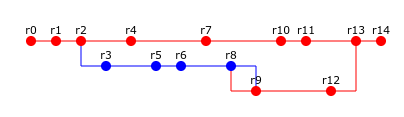

# Лабораторная работа 2

## Вариант `1571`

> War is peace, freedom is slavery, ignorance is strength, svn is version control

|.pdf|.docx|
|-|-|
| [report](./docs/report.pdf) | [report](./docs/report.docx) |

---

## Задание

Сконфигурировать в своём домашнем каталоге репозитории **svn** и **git** и загрузить в них начальную ревизию файлов с исходными кодами (в соответствии с выданным вариантом).

Воспроизвести последовательность команд для систем контроля версий **svn** и **git**, осуществляющих операции над исходным кодом, приведённые на блок-схеме.

При составлении последовательности команд необходимо учитывать следующие условия:

- Цвет элементов схемы указывает на пользователя, совершившего действие
  - :red_circle: красный – :one: первый
  - :large_blue_circle: синий – :two: второй.
- Цифры над узлами - **номер ревизии**. Ревизии создаются последовательно.
- *Необходимо разрешать конфликты между версиями, если они возникают*.

### Отчёт по лабораторной рабое должен содержать:

1. Задание и блок-схему в соответствии с вариантом.
2. Список команд, использованных при создании и конфигурации репозиториев в домашнем каталоге пользователя.
3. Номера ревизий и соответствующие им последовательности команд с комментариями (для **svn** и **git**).
4. Выводы по работе.

### Вопросы к защите лабораторной работы:

1. Системы контроля версий - назначение, примеры решений.
2. Ревизии и ветки.
3. Основные операции над данными в системах контроля версий. Основные команды **svn** и **git**.
4. Виды конфликтов и способы их решения.

---

## Полезные ссылки

| Ссылка | Описание |
| --- | --- |
| [Конспект лекций v1.4.0](https://se.ifmo.ru/documents/10180/671657/%D0%9B%D0%B5%D0%BA%D1%86%D0%B8%D0%B8+%D0%BF%D0%BE+%D0%9E%D0%9F%D0%98+v1.3.3.pdf/50ce1e06-00d9-4900-be9c-a3316a746d6d) | Конспект лекций |
| https://git-scm.com/book/en/v2 | Все что нужно знать о Git |
| https://github.com/Vsev0l0d/se4-mspi-lab2 | Пример ЛР2 |
| https://github.com/testpassword/Software-engineering-basics/tree/master/lab2-08.04.20 | Ещё один пример |
| https://github.com/nesterrovv/software-engineering-basics/tree/master/lab2 | Лаба, получившая 10 баллов у Цопы |
| https://github.com/EugeneKay/git-jokes | :trollface: Git Jokes |

А еще статьи с материалом, который может спросить *особо коварный практик*:

| Статья | Название |
| --- | --- |
| https://habr.com/ru/articles/174467/ | Ежедневная работа с Git |
| https://habr.com/ru/articles/143079/ | Что скрывает от нас директория .git |
| https://habr.com/ru/companies/vk/articles/318508/ | Малоизвестные Git-команды |
| https://habr.com/ru/articles/144626/ | Переезд проекта с SVN на Git |
| https://habr.com/ru/articles/45203/ | Работа с ветками SVN |

## Лицензия 

Проект доступен с открытым исходным кодом на условиях [Лицензии MIT](https://opensource.org/license/mit/).

*Авторские права 2024 Max Barsukov*

**Поставьте звезду :star:, если вы нашли этот проект полезным.**
